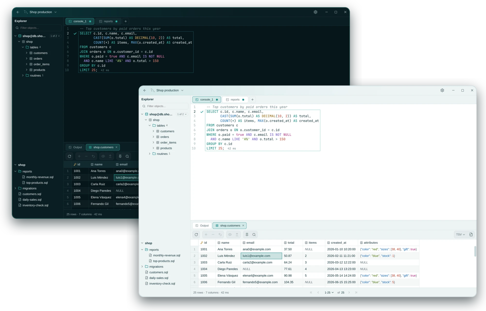

<div align="center">

<picture>
  <source media="(prefers-color-scheme: dark)" srcset="docs/assets/brand/rowly-logo-dark.svg">
  
</picture>

<br><br>

<p>
  <a href="https://github.com/anderson-andres-dev/rowly-db/stargazers"></a>
  <a href="https://github.com/anderson-andres-dev/rowly-db/issues"></a>
  <a href="https://github.com/anderson-andres-dev/rowly-db/pulls"></a>
  <a href="docs/assets/rowly-db.webp"></a>
</p>

[Download](https://github.com/anderson-andres-dev/rowly-db/releases) · [Install](#installation) · [Español](README.es.md)

</div>

<br>

<p align="center">
  
</p>

## Features

Schema explorer · SQL autocomplete · Editable results · System keyring · Confirmed updates

## Installation

Download your package from [Releases](https://github.com/anderson-andres-dev/rowly-db/releases).
Run the command in the download folder. Linux packages target **x86_64**.

| Linux | Install |
| :--- | :--- |
| Debian based `.deb` | `sudo apt install ./Rowly*.deb` |
| Fedora based `.rpm` | `sudo dnf install ./Rowly*.rpm` |
| Arch based `.pkg.tar.zst` | `sudo pacman -U ./rowly-db_*.pkg.tar.zst` |
| AppImage | `chmod +x ./Rowly*.AppImage`<br>`./Rowly*.AppImage` |

For **Windows**, run the `.msi` or `.exe`. For **macOS**, open the `.dmg` for
your processor and drag Rowly DB to Applications.

Updates are available in **Settings → Updates**.

## Build from source

Requires Rust 1.85+, Node.js 20+, and the [Tauri dependencies](https://tauri.app/start/prerequisites/).

```bash
git clone https://github.com/anderson-andres-dev/rowly-db.git
cd rowly-db/app
npm ci
npm run tauri build
```

Packages are written to `target/release/bundle/`.

## Contributing

[Development guide](CONTRIBUTING.md) · [Report an issue](https://github.com/anderson-andres-dev/rowly-db/issues)

## License

[MIT](LICENSE-MIT) or [Apache 2.0](LICENSE-APACHE).
