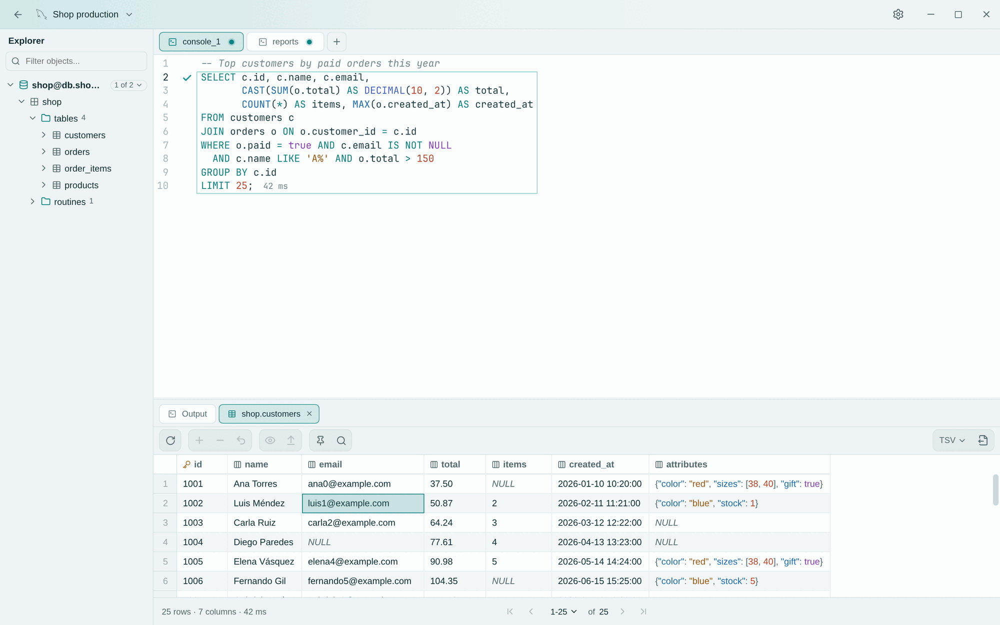

<div align="center">

# Rowly DB

**Free & Open Source SQL Client**

Connect. Query. Explore.

A lightweight desktop client for querying, exploring and understanding databases.

**100% free · Open source · No Pro edition**

[Download](https://github.com/anderson-andres-dev/rowly-db/releases) · [Documentation](docs/ARCHITECTURE.md) · [Contributing](CONTRIBUTING.md) · [Español](README.es.md)

</div>

<picture>
  <source media="(prefers-color-scheme: dark)" srcset="docs/assets/screenshot-dark.png">
  
</picture>

## Why Rowly DB

- **Free, for real.** No subscriptions, no Pro edition, no locked features.
  Everything described here is what you get.
- **Local and private.** Rowly DB talks directly to your database. Passwords
  live in your operating system's keyring, never in plain files.
- **Light.** A native desktop app built with Tauri and Rust; the Linux
  installer is about 6 MB.

## Features

**Connect** · PostgreSQL 10+, MySQL 5.7+ and MariaDB 10.3+. Connection
profiles with groups and colors, per-connection SSL modes with the negotiated
TLS state visible, and one connection per window.

**Query** · A SQL editor with schema-aware autocompletion, find and replace,
and `.sql` files. Destructive statements (`DELETE` without `WHERE`,
`TRUNCATE`, `DROP`…) ask for confirmation before they run.

**Explore** · A database explorer with tables, views, routines, sequences,
keys, indexes and triggers. A fast results grid with server-side pagination,
sorting, search, inline editing applied in a single transaction, copy as
TSV/CSV/JSON/Markdown/SQL and export with no row limit.

**Make it yours** · Eight themes: Rowly, DataGrip, VS Code, Gruvbox and
Solarized in light and dark, plus One Dark, Dracula and Nord. Available in
English, Spanish, Portuguese, French and German.

## Install

Rowly DB has no published release yet. Until the first one, you can build it
from source:

```bash
cd app
npm install
npm run tauri build
```

The installers land in `target/release/bundle/`: `.deb`, `.rpm` and AppImage
on Linux, `.dmg` on macOS, `.msi`/`.exe` on Windows.

## Development

You need Rust 1.85+ and Node.js 20+. On Linux, also the
[Tauri system dependencies](https://tauri.app/start/prerequisites/)
(WebKitGTK 4.1, GTK 3, librsvg).

```bash
cargo test --workspace          # engine and drivers
cd app && npm install
npm run check && npm test       # types and UI tests
npm run tauri dev               # run the app
```

Tests that need a real database are marked `#[ignore]`;
[CONTRIBUTING.md](CONTRIBUTING.md) explains how to run them.

## Contributing

Rowly DB is built in the open, and there is room to help at every level:

- **Report** a bug or suggest an idea in the
  [issues](https://github.com/anderson-andres-dev/rowly-db/issues).
- **Translate** the interface into a new language: each area is one file in
  `app/src/lib/i18n/messages/`.
- **Add a database**: a driver implements a single trait, `DbConnector`.
- **Improve the code**: read [CONTRIBUTING.md](CONTRIBUTING.md) and open a
  pull request.

## Architecture

The SQL engine (parsing, execution guard, pagination, editing) and the
database drivers live in `crates/`, independent of the UI. The desktop shell
is in `app/src-tauri/` and the Svelte interface in `app/src/`. More in
[`docs/ARCHITECTURE.md`](docs/ARCHITECTURE.md).

Built with [Tauri 2](https://tauri.app/), Rust, Svelte 5,
[CodeMirror 6](https://codemirror.net/),
[sqlparser](https://github.com/apache/datafusion-sqlparser-rs) and
[SQLx](https://github.com/launchbadge/sqlx).

**Rowly DB and Khipu.** Rowly DB is the product. Khipu is the name of its
internal engine, which is why the crates are called `khipu-*`.

## License

Rowly DB is dual-licensed under [MIT](LICENSE-MIT) or
[Apache-2.0](LICENSE-APACHE), at your option.
